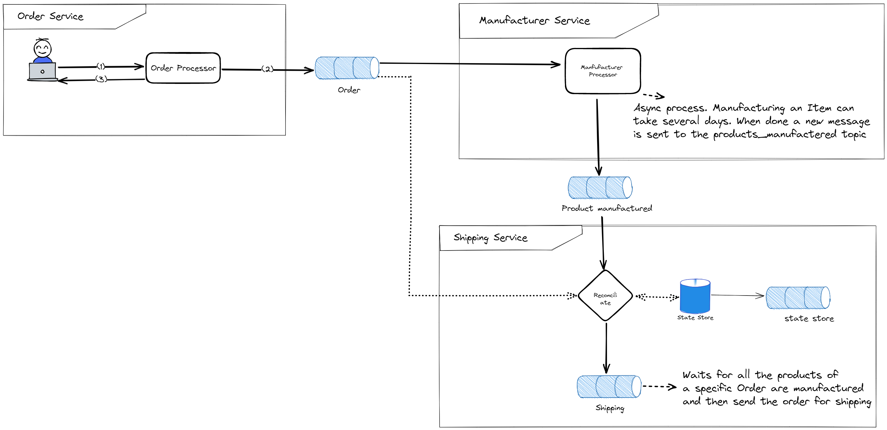

# Kafka Streams reconciliation


# Intro



This demo shows how we can use Kafka Streams to create an asynchronous order system.

This demo represents an online manufacturer system. The manufacturer company uses this system to receive the orders from the customers and manage the manufacturer and shipping process.

The system is composed by 3 independent services:
- **Order service**. Receives the orders from the users and submits them to a Kafka topic.
- **Manufacturer service**. It will list for all new messages in the order topic, and for each one it will request the manufacturer of the products. Here we assume that our company doesn't have stock and has to manufacture every product of the order.
- **Shipping service**. After all items of the order are manufactured the shipping service can move the order to the shipping phase.

As seen in the diagram, our 3 components are completely independent. There is no direct communication between them, all the events are sent to Kafka topics. In this event based approach each service can attach to the topics that contain the events they are interested in.
For example the Manufacturer process reads events from the orders topics to be aware of new orders, and when one product is manufactured it emits an event to the products manufactured topic.


# Reconciliate Orders and Manufactured products using KStreams

The question now, is how the shipping process can be aware that an order was made, and that all products are manufactured before starting the shipping process. Since there is no common database keeping the status of the order, we have to rely only on the data stored in the Kafka topics.


We have multiple solutions to solve this problem, we could use polling, a plain Kafka consumer or even a batch. But this demo shows how to do the reconciliation using KStreams. [Kafka Streams](https://kafka.apache.org/documentation/streams/) is an abstraction for the Kafka consumer and producer APIs that allow us to focus on the business code instead of the technical details. 

>Kafka Streams is a client library for building applications and microservices, where the input and output data are stored in Kafka clusters. It combines the simplicity of writing and deploying >standard Java and Scala applications on the client side with the benefits of Kafka's server-side cluster technology.
>
>https://kafka.apache.org/documentation/streams/


The advantage of Kafka streams is that we can focus on our business logic while the boilerplate code is implemented by the Kafka streams library. Kafka Streams allows us to implement stateless and stateful operations, the solution we are trying to implement is definitely a stateful operation. We have to know the status of the order before deciding to emit or not an event to the shipping topic.

Stateful operations are implemented in KStreams using **State stores**. [State stores](https://kafka.apache.org/21/documentation/streams/developer-guide/processor-api.html#state-stores) are in memory databases backed by RocksDb that are also persisted on a Kafka topic. So even in the case where the app crashes, our data is safe and our application can easily resume after a restart.

## Implementation

The KStream application reads messages from the orders and products manufactured topic, for each message received the application calculates the status of the order and stores it in a State store.
For example, if the KStream application receives a new message from the Order topic, it will create a new entry on the state store containing the order ID and the IDs of the products that are waiting for manufacturing. For each product manufactured it will also receive a new message, and it will update the order status accordingly in the state store. After all products of an order are manufactured, the KStream application will emit a new message to the shipping topic.
After this message the order is completed.

Let's see an example of the evolution of the state store for a Order with ID 1 containing 2 products, Product A and Product B.
As seen in the next image, the state store evolves with the messages received from the orders and products manufactured topic. For each event received it will update the order status in the state store. When it detects that the order is ready to be shipped, the KStream will emit a new message to the shipping topic.


# How to run the application


Use docker to start the Kafka cluster:

```docker compose up -d```

AKHQ  is now accessible in the URL: http://localhost:9090/ui/docker-kafka-server/topic

## Test the reconciliation process

1. Run the Stream application:
 
    ```./gradlew runKStream```

    The KStream application will wait for new events.

1. **Create a new order by running the OrderProducer main.**

    ```./gradlew runOrderProducer```

    You should see on the logs a message similar to the following:
    ```
    Successfully sent new order to the orders topic: OrderDto[id='0af9bdce-3825-41a8-870e-1ed9a37a97ba', orderDate=2023-05-08T21:37:38.571850862, items=[ProductDto[id=1, name='Iphone'], ProductDto[id=2, name='Samsung']]]
    ```

    The previous order has the id 0af9bdce-3825-41a8-870e-1ed9a37a97ba, and contains 2 items. The streaming application will wait that the 2 items of the order are manufactured before sending the order to shipping.
   
1. **Check the logs of the Stream application**
    
    With the order already present in the Kafka "orders" topic, you should see the following logs in the stream application:
    ```  
    INFO  c.h.s.OrderManufacturingStatus - 0/2 manufactured products
    INFO  c.h.shipping.processor.BaseProcessor - Not all items of order 0af9bdce-3825-41a8-870e-1ed9a37a97ba were manufactured, waiting
    ```

    You can see on the previous log lines that the stream application detected a new order. This order contains 2 products that weren't yet manufactured. So the stream application is waiting for the products to be manufactured before emitting a new message to the shipping topic.    
  
1. **Send a message to the "products manufactured" topic containing the first item of the order.**

    ```./gradlew  runProductManufacturedProducer --args='4da816c2-3e4a-4a3c-94fb-3b60cdfa7618 1'```	

    **Replace the order id by the order Id generated before when you ran the orderProducer**

    On the KStream application logs you should see the information that 1 out 2 products were manufactured. However the KStream application is still waiting for the second one before shipping the order.

    ```
    INFO  c.h.s.OrderManufacturingStatus - 1/2 manufactured products
    INFO  c.h.shipping.processor.BaseProcessor - Not all items of order 4da816c2-3e4a-4a3c-94fb-3b60cdfa7618 were manufactured, waiting
    ```

1. **Send a message to the "products manufactured" topic containing the last item of the order.**

    ```./gradlew  runProductManufacturedProducer --args='4da816c2-3e4a-4a3c-94fb-3b60cdfa7618 2'```	

    With the last item of the order manufactured we the KStream application can now send the order for shipping. If we check the logs we see that was what happened. The KStream reconciliated all the information and detected that all items of the order were manufactured. So it emitted a new message to the shipping topic. 

    ```
    INFO  c.h.s.OrderManufacturingStatus - 2/2 manufactured products
    INFO  c.h.shipping.processor.BaseProcessor - All items of order 4da816c2-3e4a-4a3c-94fb-3b60cdfa7618 were manufactured, forwarding event to shipping
    ```

    If you check also the shipping topic on [AKHQ](http://localhost:9090/ui/docker-kafka-server/topic/shipping/data?sort=NEWEST&partition=All) you should see a new message in the shipping topic.


You can try to run this commands in a different order to see how the KStream application reacts to different scenarios. For example, you can try to send the message to the "products manufactured" topic before sending the order to the "orders" topic. You will see that the KStream will handle this case successfully. Due to the asynchronous nature of Kafka the KStream application was built taking into account that the messages can arrive in any order.